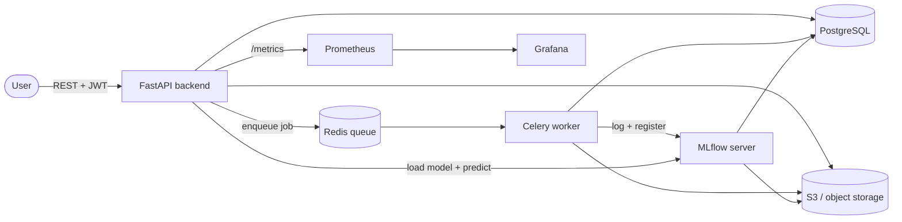

# ModelForge


**A cloud-native MLOps platform.** Upload a dataset, train a machine-learning
model, track the experiment, register and deploy the model, and serve live
predictions — all through a REST API, with the full production stack around it:
containers, Kubernetes, infrastructure-as-code, CI/CD, observability, and
fault-tolerant background processing.

> Built as an end-to-end project covering Backend, MLOps, and DevOps.

---

## What it does

ModelForge takes a model from raw data to live predictions through the complete
ML lifecycle:

```
upload CSV → train (async) → track + register (MLflow) → deploy → predict on new data
```

- **Upload datasets** (CSV) — stored in object storage, metadata in Postgres.
- **Train models** asynchronously — submit a job, a Celery worker trains a
  scikit-learn model in the background (classification or regression, with
  task-appropriate metrics).
- **Track experiments** — every run's params, metrics, and artifacts are logged
  to MLflow.
- **Register & version models** — trained models land in the MLflow Model
  Registry, versioned.
- **Deploy & serve** — deploy a registered model version and get predictions on
  new data via a REST endpoint.
- **Multi-tenant & secure** — JWT auth with per-user data ownership and roles.

---

## Architecture



The **API** stays fast by offloading training to a **queue**; **workers**
process jobs in the background; **MLflow** is the source of truth for tracked
runs and registered models; **Prometheus/Grafana** observe it all.

---

## Tech stack

| Area | Tools |
|---|---|
| **API** | FastAPI, Pydantic, Uvicorn |
| **Database** | PostgreSQL, SQLAlchemy, Alembic (migrations) |
| **Object storage** | AWS S3 (LocalStack for local dev) |
| **Background jobs** | Celery + Redis (retries, idempotency, dead-letter, `acks_late`) |
| **ML** | scikit-learn (random forest) |
| **Experiment tracking / registry** | MLflow |
| **Auth** | JWT (access + refresh), bcrypt, role-based authorization |
| **Containers** | Docker (multi-stage), Docker Compose |
| **Orchestration** | Kubernetes (manifests, runnable on `kind`) |
| **Infrastructure as code** | Terraform |
| **CI/CD** | GitHub Actions (lint, type-check, test, build, Trivy scan, kind integration tests, `terraform plan`) |
| **Observability** | Prometheus + Grafana |

---

## Quick start

The entire platform runs locally with one command — no AWS account needed
(LocalStack stands in for S3).

```bash
git clone https://github.com/gragbag/ModelForge.git
cd ModelForge
docker compose up -d --build
```

This starts the backend, worker, PostgreSQL, Redis, LocalStack (S3), MLflow,
Prometheus, and Grafana. Once up:

| Service | URL |
|---|---|
| API docs (Swagger) | http://localhost:8000/docs |
| MLflow UI | http://localhost:5000 |
| Grafana | http://localhost:3000 (admin / admin) |
| Prometheus | http://localhost:9090 |

### Try the full lifecycle

```bash
# 1. Register + log in
curl -s -X POST http://localhost:8000/auth/register -H "Content-Type: application/json" \
  -d '{"email":"demo@example.com","password":"secret123"}'
TOKEN=$(curl -s -X POST http://localhost:8000/auth/login -H "Content-Type: application/json" \
  -d '{"email":"demo@example.com","password":"secret123"}' | python3 -c "import sys,json;print(json.load(sys.stdin)['access_token'])")

# 2. Upload a dataset
DSID=$(curl -s -H "Authorization: Bearer $TOKEN" -F "file=@sample_data/students.csv" \
  http://localhost:8000/datasets | python3 -c "import sys,json;print(json.load(sys.stdin)['id'])")

# 3. Train a model (async)
curl -s -X POST http://localhost:8000/jobs -H "Authorization: Bearer $TOKEN" \
  -H "Content-Type: application/json" \
  -d "{\"dataset_id\": $DSID, \"model_type\":\"random_forest\",\"target_column\":\"passed\",\"task_type\":\"classification\"}"

# 4. Deploy the registered model + predict on a new row
curl -s -X POST http://localhost:8000/deployments -H "Authorization: Bearer $TOKEN" \
  -H "Content-Type: application/json" -d '{"model_name":"modelforge-model","model_version":"1"}'
curl -s -X POST http://localhost:8000/deployments/1/predict -H "Authorization: Bearer $TOKEN" \
  -H "Content-Type: application/json" \
  -d '{"features": {"hours_studied": 8, "prev_score": 80, "attendance": 95}}'
```

---

## Key highlights

- **Asynchronous training pipeline** with a Redis/Celery queue so the API never
  blocks on long-running work.
- **Fault tolerance** — training jobs retry transient failures with exponential
  backoff, are idempotent (safe to re-run), survive a worker crash mid-job
  (`acks_late`), and record permanent failures for inspection. Errors are
  classified transient (retry) vs. permanent (fail fast).
- **Reproducible environments** — one `docker compose up` brings up the whole
  stack; the same images deploy to Kubernetes; all cloud infra is Terraform.
- **Production-shaped auth** — JWT access + refresh tokens, bcrypt password
  hashing, per-user resource ownership, and admin role-based access.
- **Real observability** — Prometheus scrapes the API; Grafana dashboards show
  request rate and latency percentiles.

---

## Deployment

### Kubernetes
Manifests in [`k8s/`](k8s/) deploy the full stack to a cluster (e.g. local `kind`):

```bash
kind create cluster
kind load docker-image modelforge-app:latest
kubectl apply -f k8s/namespace.yaml && kubectl apply -f k8s/
kubectl -n modelforge scale deployment/worker --replicas=4   # horizontal scaling
```

### Infrastructure as Code
Cloud resources are defined in Terraform under [`infrastructure/`](infrastructure/)
(`terraform plan` / `apply` / `destroy`) — provisioned reproducibly, not by hand.

### CI/CD
[`.github/workflows/ci.yml`](.github/workflows/ci.yml) runs on every push/PR:
lint (ruff), type-check (mypy), tests (pytest), multi-stage Docker build, Trivy
vulnerability scan, integration tests against a real `kind` cluster, and
`terraform plan`.

---

## Project structure

```
backend/            FastAPI app, Celery worker, SQLAlchemy models, Alembic migrations
k8s/                Kubernetes manifests
infrastructure/     Terraform (AWS infra as code)
monitoring/         Prometheus config + Grafana provisioning
docker/             Postgres init scripts
.github/workflows/  CI/CD pipeline
sample_data/        Example CSVs (classification + regression)
frontend/           React + Vite dashboard (in progress)
```

---

## Screenshots

_Coming soon._

---

## Author

Built by Julian — [GitHub](https://github.com/gragbag)
